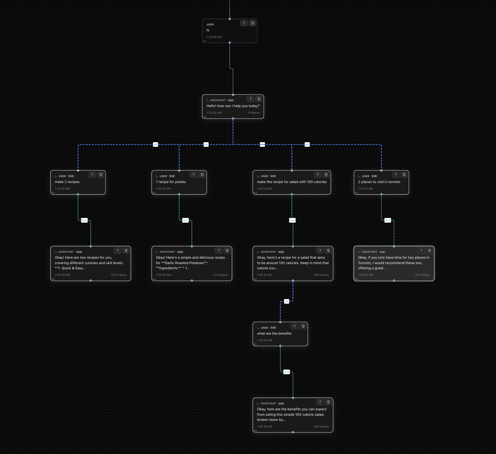

# ChaTree - Git for LLM

> **Organize, explore, and branch your AI conversations like never before.**

ChaTree is a revolutionary conversation management system that brings the power of version control to AI interactions. Create complex dialogue trees with intelligent context management and seamless navigation through your chat history.



## 🚀 Features

### **Branching Conversations**
- **Create sub-conversations** from any point in your chat
- **Explore different topics** without losing context
- **Navigate between branches** seamlessly
- **Merge insights** from multiple conversation paths

### **Hierarchical Memory System**
- **Main Branch**: Has memory of all sub-branches (full context)
- **Sub-branches**: Isolated memory (focused conversations)
- **Smart Context Management**: Only relevant context is sent to the LLM
- **Memory Indicators**: Visual feedback on memory scope

### **Advanced Context Management**
- **Pin Important Nodes**: Keep crucial information in context
- **Automatic Context Compilation**: Intelligent context selection
- **Token Optimization**: Efficient context management
- **Real-time Context Preview**: See what context is being used

### **Multiple LLM Support**
- **Google Gemini 2.0 Flash** (Primary)
- **OpenAI GPT-4** (Fallback)
- **Anthropic Claude** (Alternative)
- **Mock Responses** (Development)

## 🛠️ Installation

### Prerequisites
- Node.js 16+ 
- npm or yarn

### Quick Start

```bash
# Clone the repository
git clone https://github.com/yourusername/chattree.git
cd chattree

# Install dependencies
npm install

# Set up environment variables
cp .env.example .env
# Edit .env with your API keys

# Start the development server
npm start
```

### Environment Setup

Create a `.env` file in the project root:

```env
# Primary LLM (Recommended)
REACT_APP_GEMINI_API_KEY=your_gemini_api_key_here

# Alternative LLMs (Optional)
REACT_APP_OPENAI_API_KEY=your_openai_api_key_here
REACT_APP_ANTHROPIC_API_KEY=your_anthropic_api_key_here
```

#### Getting API Keys

**Gemini API (Recommended)**
1. Visit [Google AI Studio](https://aistudio.google.com/)
2. Sign in with your Google account
3. Click "Get API Key" → "Create API Key"
4. Copy the generated key

**OpenAI API**
1. Visit [OpenAI Platform](https://platform.openai.com/)
2. Go to API Keys section
3. Create a new secret key

**Anthropic Claude**
1. Visit [Anthropic Console](https://console.anthropic.com/)
2. Navigate to API Keys
3. Generate a new key

## 🎯 Usage

### Basic Workflow

1. **Start a Conversation**
   - Type your initial message
   - The system creates your first conversation node

2. **Branch Your Conversations**
   - Click on any node to make it active
   - Type a new message to create a sub-branch
   - Explore different topics without losing context

3. **Navigate Between Branches**
   - Click on any node to switch contexts
   - Use the visual tree to understand conversation flow
   - Pin important nodes for persistent context

4. **Manage Memory**
   - Main branch sees all sub-conversations
   - Sub-branches have isolated memory
   - Visual indicators show memory scope

### Advanced Features

#### Pinning Nodes
- Click the 📌 icon on any node to pin it
- Pinned nodes are always included in context
- Only one node can be pinned at a time

#### Context Panel
- View current context information
- See memory type (hierarchical vs isolated)
- Monitor token usage and context size

#### Search and Navigation
- Search through conversation history
- Quick navigation between nodes
- Visual tree representation

## 🏗️ Architecture

### Core Components

```
src/
├── components/          # React components
│   ├── ChatTree.jsx     # Main conversation tree
│   ├── MessageNode.jsx  # Individual message nodes
│   ├── ContextPanel.jsx # Context information
│   └── MessageInput.jsx # Input handling
├── context/            # React context
│   └── TreeContext.jsx # State management
├── hooks/              # Custom hooks
│   ├── useChatTree.js  # Tree operations
│   └── useLLM.js       # LLM API integration
└── utils/              # Utilities
    ├── contextCompiler.js # Context compilation
    ├── treeUtils.js        # Tree operations
    └── storage.js          # Data persistence
```

### Memory System

The hierarchical memory system is the core innovation:

```javascript
// Main branch context compilation
if (isInMainBranch) {
  // Include ancestor path + ALL descendants
  context = ancestorPath + allDescendants;
} else {
  // Sub-branch: only ancestor path
  context = ancestorPath;
}
```

### Data Structure

```javascript
// Node structure
{
  id: "uuid",
  parentId: "parent-uuid" | null,
  children: ["child-id-1", "child-id-2"],
  role: "user" | "assistant",
  content: "message content",
  metadata: {
    timestamp: 1234567890,
    modelUsed: "gemini-2.0-flash-exp",
    tokenCount: 150,
    isPinned: false
  }
}
```

## 🔧 Development

### Project Structure

```
chattree/
├── public/              # Static assets
├── src/                 # Source code
├── build/               # Production build
├── .env                 # Environment variables
├── package.json         # Dependencies
└── README.md           # This file
```

### Available Scripts

```bash
# Development
npm start              # Start development server
npm run build          # Build for production
npm test               # Run tests

# Development tools
npm run lint           # Run ESLint
npm run format         # Format code with Prettier
```

### Contributing

1. Fork the repository
2. Create a feature branch (`git checkout -b feature/amazing-feature`)
3. Commit your changes (`git commit -m 'Add amazing feature'`)
4. Push to the branch (`git push origin feature/amazing-feature`)
5. Open a Pull Request

## 🎨 Customization

### Styling
- Modify `src/styles/App.css` for custom themes
- Dark theme is the default
- Responsive design for all screen sizes

### LLM Configuration
- Edit `src/hooks/useLLM.js` for custom LLM settings
- Adjust temperature, max tokens, and other parameters
- Add support for new LLM providers

### Context Management
- Modify `src/utils/contextCompiler.js` for custom context logic
- Adjust memory hierarchy rules
- Implement custom context strategies

## 📊 Performance

### Optimization Features
- **Efficient Context Compilation**: Only relevant context is sent
- **Token Management**: Automatic token counting and optimization
- **Lazy Loading**: Nodes are loaded as needed
- **Memory Management**: Automatic cleanup of old conversations

### Benchmarks
- **Context Compilation**: < 10ms for typical conversations
- **Memory Usage**: < 50MB for 1000+ node trees
- **Response Time**: < 2s for LLM API calls

## 🔒 Security

### Data Privacy
- **Local Storage**: All data stored locally in browser
- **No Server**: No data sent to external servers (except LLM APIs)
- **API Keys**: Stored securely in environment variables
- **No Tracking**: No analytics or user tracking

### API Key Management
- Keys stored in `.env` file (not committed to git)
- Fallback to mock responses if API keys are missing
- Support for multiple LLM providers

## 🚀 Deployment

### Production Build

```bash
# Build for production
npm run build

# Serve the build folder
npx serve -s build
```

### Deployment Options
- **Vercel**: `vercel --prod`
- **Netlify**: Connect GitHub repository
- **GitHub Pages**: Use `gh-pages` package
- **Docker**: Use provided Dockerfile

## 📈 Roadmap

### Upcoming Features
- [ ] **Conversation Export**: Export to markdown, PDF
- [ ] **Collaborative Editing**: Real-time collaboration
- [ ] **Plugin System**: Custom extensions
- [ ] **Mobile App**: React Native version
- [ ] **Voice Integration**: Speech-to-text support
- [ ] **Image Support**: Multimodal conversations

### Version History
- **v1.0.0**: Initial release with basic branching
- **v1.1.0**: Hierarchical memory system
- **v1.2.0**: Multiple LLM support
- **v1.3.0**: Advanced context management

## 🤝 Community

### Support
- **GitHub Issues**: Report bugs and request features
- **Discussions**: Community discussions and Q&A
- **Discord**: Real-time community chat

### Contributing
- **Bug Reports**: Use GitHub issues
- **Feature Requests**: Use GitHub discussions
- **Code Contributions**: Submit pull requests
- **Documentation**: Help improve docs

## 📄 License

This project is licensed under the MIT License - see the [LICENSE](LICENSE) file for details.

## 🙏 Acknowledgments

- **React Flow**: For the beautiful tree visualization
- **Google Gemini**: For the fast and efficient LLM API
- **OpenAI**: For the reliable GPT models
- **Anthropic**: For the thoughtful Claude models

---

**Built with ❤️ by [stevenmathew.dev](https://stevenmathew.dev)**

*ChaTree - Where conversations branch and memories persist.*